# StockPro Frontend

[](https://angular.dev/)
[](https://www.typescriptlang.org/)
[](https://material.angular.io/)
[](https://tailwindcss.com/)
[](https://www.chartjs.org/)

StockPro Frontend is an Angular inventory management dashboard for the StockPro microservices backend. It provides a secure SaaS-style interface for managing products, warehouses, suppliers, purchase orders, stock movements, alerts, reports, and admin workflows.

The app is built with standalone Angular components, lazy-loaded routes, JWT authentication, role-based access control, Angular Material, Tailwind CSS, and Chart.js dashboards.

## Contents

- [Features](#features)
- [Tech Stack](#tech-stack)
- [Application Modules](#application-modules)
- [Architecture](#architecture)
- [Project Structure](#project-structure)
- [Getting Started](#getting-started)
- [Backend Connection](#backend-connection)
- [Build and Deployment](#build-and-deployment)
- [Security Notes](#security-notes)

## Features

- Login, registration, logout, and password reset screens
- JWT session handling with browser-side token restoration
- Route protection with authentication and role guards
- Role-aware navigation for `ADMIN`, `MANAGER`, `STAFF`, and `OFFICER`
- Centralized API service for typed HTTP calls
- HTTP auth interceptor for `Authorization: Bearer <token>`
- Global error interceptor with user-facing notifications
- Responsive application shell with dark and light theme support
- Dashboard and reporting views powered by Chart.js
- CRUD-focused pages for products, warehouses, suppliers, and purchase orders
- Stock movement history, inventory alerts, and admin user management
- Production-ready Docker build served through Nginx

## Tech Stack

| Area | Technology |
| --- | --- |
| Framework | Angular 17.3 |
| Language | TypeScript 5.4 |
| UI library | Angular Material 17.3 |
| Styling | SCSS, Tailwind CSS 3.4 |
| Charts | Chart.js, ng2-charts |
| Routing | Angular Router with lazy loading |
| State/session | RxJS, local token storage |
| HTTP | Angular HttpClient with interceptors |
| Build tool | Angular CLI |
| Deployment | Docker, Nginx |

## Application Modules

| Route | Module | Access |
| --- | --- | --- |
| `/auth/login` | Login | Public |
| `/auth/register` | Registration | Public |
| `/auth/reset-password` | Password reset | Public |
| `/dashboard` | Dashboard KPIs | Authenticated users |
| `/products` | Product catalogue | Admin, Manager, Staff, Officer |
| `/warehouses` | Warehouse and stock management | Admin, Manager, Officer |
| `/purchase-orders` | Purchase order workflow | Admin, Manager, Officer |
| `/suppliers` | Supplier management | Admin, Manager, Officer |
| `/stock-movements` | Stock movement history | Admin, Manager, Staff, Officer |
| `/alerts` | Inventory alerts | Admin, Manager, Staff, Officer |
| `/reports` | Reports and analytics | Admin, Manager |
| `/admin` | Admin panel | Admin |

## Architecture

```mermaid
flowchart LR
    User["User"] --> Angular["Angular Frontend :4200"]
    Angular --> Router["Lazy-loaded Routes"]
    Router --> Guards["Auth + Role Guards"]
    Guards --> Shell["App Shell"]
    Shell --> Pages["Feature Pages"]
    Pages --> Services["Core API Services"]
    Services --> Interceptors["Auth + Error Interceptors"]
    Interceptors --> API["/api"]
    API --> Gateway["StockPro API Gateway :8080"]
```



Development requests use the Angular proxy:

```text
/api -> http://127.0.0.1:8080
```

Production requests are served by Nginx and proxied to:

```text
http://api-gateway:8080/api/
```

## Project Structure

```text
InventoryManagementApp-Frontend/
  public/
  src/
    app/
      core/
        guards/
        handlers/
        interceptors/
        models/
        services/
      features/
        admin/
        alerts/
        auth/
        dashboard/
        products/
        purchase-orders/
        reports/
        stock-movements/
        suppliers/
        warehouses/
      shared/
        layout/
        ui/
    environments/
    styles.scss
  angular.json
  proxy.conf.json
  Dockerfile
  nginx.conf
```

## Getting Started

### Prerequisites

- Node.js 20+
- npm 10+
- Angular CLI 17+
- StockPro backend gateway running on port `8080`

### 1. Install dependencies

```bash
npm install
```

### 2. Start the development server

```bash
npm start
```

The app runs at:

```text
http://127.0.0.1:4200
```

Angular uses `proxy.conf.json` to forward `/api` requests to the backend gateway.

### 3. Run tests

```bash
npm test
```

### 4. Create a production build

```bash
npm run build
```

Build output is generated in:

```text
dist/stockpro-inventory-frontend/
```

## Backend Connection

The frontend uses `src/environments/environment.ts` and `src/environments/environment.prod.ts`:

```ts
export const environment = {
  production: false,
  apiBaseUrl: '/api'
};
```

All API calls are made relative to `/api`, which keeps local and deployed builds consistent.

| Environment | API routing |
| --- | --- |
| Local dev | Angular proxy forwards `/api` to `http://127.0.0.1:8080` |
| Docker/Nginx | Nginx forwards `/api/` to `http://api-gateway:8080/api/` |

## Build and Deployment

### Docker

Build the image:

```bash
docker build -t stockpro-frontend .
```

Run the container:

```bash
docker run -p 4200:80 stockpro-frontend
```

The Docker image uses a two-stage build:

1. `node:20-alpine` builds the Angular production bundle.
2. `nginx:alpine` serves the compiled app and proxies API calls.

### Nginx

The included Nginx config:

- Serves Angular routes through `index.html`
- Exposes `/health`
- Proxies `/api/` to the backend gateway
- Enables gzip compression for common web assets

## Available Scripts

| Command | Description |
| --- | --- |
| `npm start` | Start Angular dev server |
| `npm run dev` | Alias for Angular dev server |
| `npm run build` | Build production app |
| `npm run watch` | Build in watch mode with development config |
| `npm test` | Run Karma/Jasmine tests |

## Security Notes

- No backend secrets are required in the frontend repository.
- Keep JWTs short-lived and validate them on the backend gateway.
- Do not hardcode API keys, SMTP credentials, database credentials, or admin passwords in frontend files.
- Use environment-specific deployment configuration for public URLs and reverse proxies.
- Review generated folders such as `dist/`, `.angular/`, and `node_modules/` before publishing.

## License

Add a license file before publishing if this project will be shared publicly.


## AUTHOR
Saket Mishra
